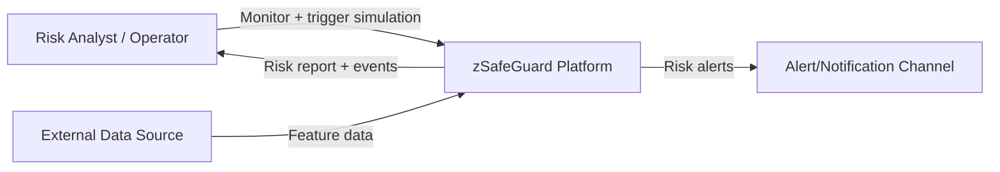
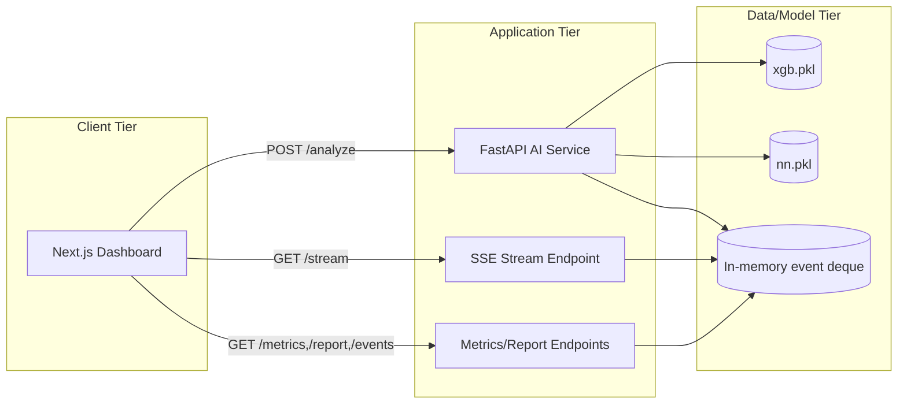
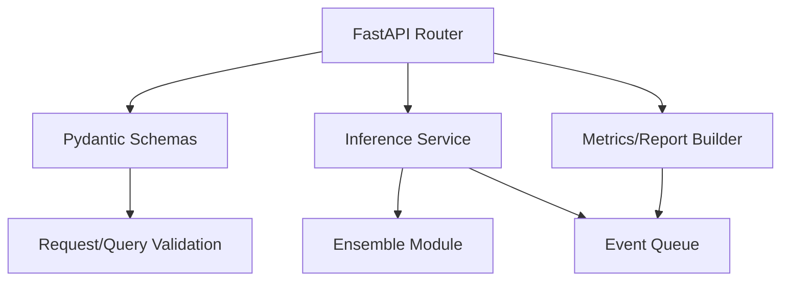

# zSafeGuard Architecture (C4 Model)

เอกสารนี้สรุปสถาปัตยกรรมระบบ zSafeGuard ตามแนวคิด C4 (Context, Container, Component)
เพื่อช่วยให้ทีม Dev/Ops/Data เข้าใจขอบเขตระบบและจุดเชื่อมต่ออย่างเป็นระบบ

## 1) System Context

**คำอธิบาย:**
- ผู้ใช้หลักคือ Analyst/Operator ที่ดูสถานะความเสี่ยงผ่าน Dashboard
- ข้อมูลภายนอกถูกแปลงเป็น feature vector แล้วส่งเข้า AI API
- ระบบส่งผลวิเคราะห์ความเสี่ยงและเหตุการณ์แบบ real-time กลับให้ผู้ใช้

## 2) Container Diagram

**คำอธิบาย:**
- Dashboard เป็น UI สำหรับจำลองข้อมูลและดูผล
- AI Service รับ request, เรียก ensemble model, และจัดเก็บเหตุการณ์ล่าสุดในหน่วยความจำ
- Stream/Analytics endpoint ใช้ event store ร่วมกันเพื่อรองรับหน้าจอ real-time

## 3) Component Diagram (AI Service)

**คำอธิบาย:**
- Router จัดการ endpoint และ OpenAPI schema
- Pydantic schema รับผิดชอบ contract ของ request/response
- Inference service ใช้โมเดล ensemble (`xgb` และ `nn`) เพื่อสร้าง score
- Reporter คำนวณ aggregation จาก event queue เพื่อรายงานผลเชิงสถิติ

## 4) Deployment View (ย่อ)

- Runtime หลัก: Docker container ของ FastAPI service
- รองรับ Kubernetes deployment ผ่านไฟล์ใน `k8s/`
- CI/CD pipeline ทำการรัน test และ build image อัตโนมัติบน branch หลัก
